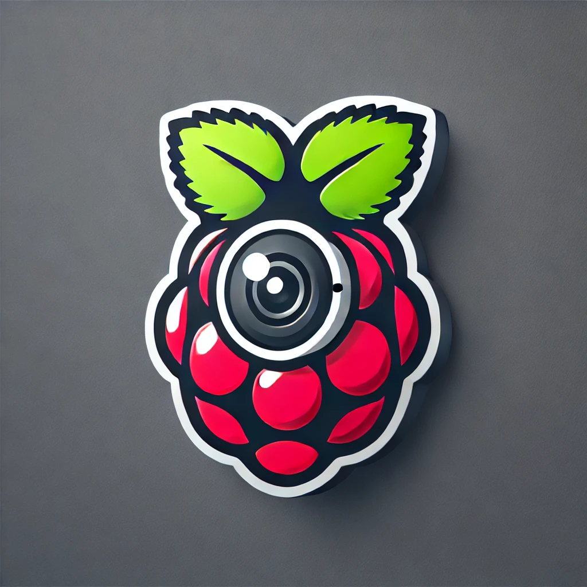

# rpi_surveillance
Surveillance app for Raspberry pi and Hailo AI Kit



# Camera Setup

```bash
sudo apt update && sudo apt upgrade
sudo apt install libcap-dev libatlas-base-dev ffmpeg libopenjp2-7
sudo apt install libcamera-dev
sudo apt install libkms++-dev libfmt-dev libdrm-dev
```

```bash
pip install --upgrade pip
pip install wheel
pip install rpi-libcamera rpi-kms picamera2
```

# Install Hailo SDK

```bash

```


